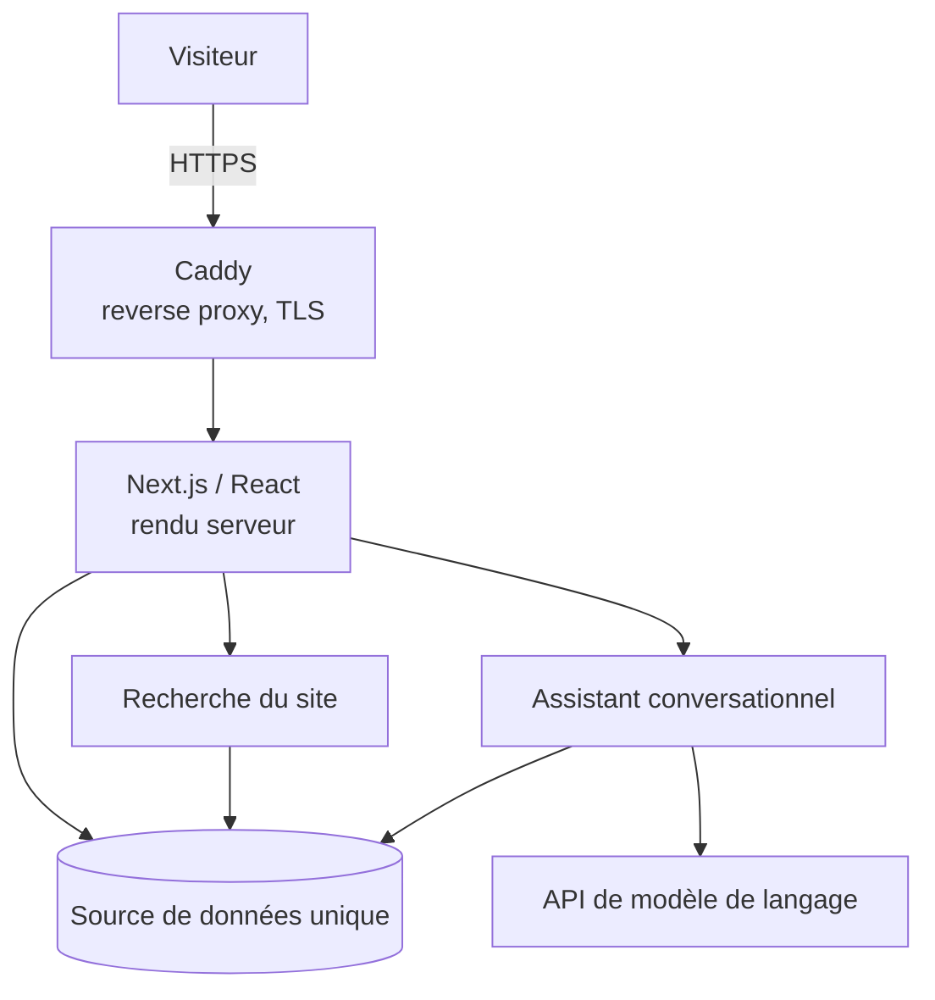

# ernestdiby.fr, architecture

Documentation technique du portfolio professionnel [ernestdiby.fr](https://ernestdiby.fr) :
architecture, choix d'ingénierie et principes de publication.

**Le code source n'est pas publié dans ce dépôt.** Il reste dans un dépôt privé.

## Objectif

Une application web conçue, développée, déployée et exploitée de bout en bout,
par une seule personne. Le support qui présente les réalisations est construit
selon les mêmes principes qu'elles : source de données unique, déploiement
reproductible, exploitation que l'on peut tenir seul.

## Vue générale

Composants logiques. La configuration de production n'y figure pas.

## Composants

| Domaine | Technologies |
|---|---|
| Application | TypeScript, React, Next.js, Tailwind CSS |
| Conteneurisation | Docker, Docker Compose |
| Infrastructure | VPS Ubuntu, Caddy, TLS Let's Encrypt |
| Assistant | API de modèle de langage, base de connaissances dérivée du site |

## Documentation

| Document | Contenu |
|---|---|
| [Architecture](docs/architecture.md) | composants, données, choix techniques, limites |
| [Déploiement](docs/deployment.md) | chaîne de build et de mise en ligne |
| [Ask Ernest](docs/ask-ernest.md) | assistant conversationnel et garde-fous |
| [Recherche](docs/search.md) | index dérivé et classement |
| [Sécurité et confidentialité](docs/security.md) | secrets, données, frontière de publication |

## Ce qui n'est pas publié

Ni code source, ni secret, ni configuration de production, ni donnée
d'exploitation. Les projets professionnels décrits sur le site ont été menés
dans un système d'information hospitalier : la même réserve s'applique ici.

## Projet

Site : <https://ernestdiby.fr>

Auteur : Ernest DIBY
