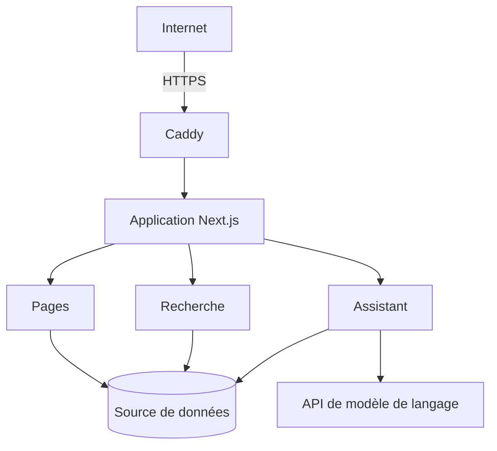

# Architecture

## Vue générale

Une application, un conteneur, un reverse proxy.

## Application

Rendu côté serveur, pages préconstruites au build. Le HTML servi contient le
contenu réel : lisible sans JavaScript, indexable, affiché avant toute
hydratation.

L'interface reprend la métaphore d'un poste de travail, fenêtre et dock. Ce
châssis est un composant client unique ; le contenu reste rendu au serveur.

## Données

**Une seule source.** Parcours, réalisations, compétences et formations vivent
dans un fichier de données typé à la frontière du code.

En dérivent les pages, l'index de recherche, le terminal intégré, la base de
connaissances de l'assistant et les données structurées lues par les moteurs de
recherche. Une correction faite une fois se propage partout.

C'est la décision structurante du projet : une même information portée à deux
endroits finit par diverger, sans que rien ne le signale.

### Le contrôle associé

Ce type de divergence n'est vu ni par le typage, ni par le lint, ni par le
build. Le projet embarque un vérificateur d'invariants, qui contrôle les accords
entre fichiers : séparateurs servant aussi de mécanisme, champs de tri
obligatoires, plancher de contraste sur toutes les surfaces, plafonds écrits des
deux côtés d'une frontière. Il ne lit que les sources, et tourne avant chaque
mise en ligne.

## Observabilité

Mesure d'audience côté serveur, à partir des journaux d'accès du reverse proxy.
Aucun cookie, aucun script de mesure, aucun service tiers. L'adresse est réduite
à son réseau puis transformée en empreinte ; l'adresse complète n'est pas
conservée dans la base de mesure.

## Choix techniques

Des décisions, pas des préférences.

**Next.js** regroupe rendu, routage et logique applicative dans un même socle,
avec un déploiement assez simple pour être exploité seul. Le rendu serveur était
la contrainte de départ : un portfolio doit être lisible et indexable sans
JavaScript.

**Docker** réduit l'écart entre développement et production et rend le
déploiement reproductible.

**Caddy** sépare l'exposition HTTPS de l'application et gère les certificats
sans intervention.

**Un fichier de données plutôt qu'une base.** Le contenu change quelques fois
par mois, sans écriture concurrente. Une base aurait ajouté un service à
exploiter et sauvegarder, pour un besoin que le système de fichiers couvre.

**Pas de recherche vectorielle pour l'assistant.** La base de connaissances tient
en quelques milliers de jetons ; l'index vectoriel coûterait plus à maintenir
qu'il ne rapporterait.

**Quatre dépendances de production.** Chaque dépendance est une surface à suivre.

## Compromis et limites

**Architecture volontairement simple.** La complexité opérationnelle est limitée
à ce qu'une personne peut tenir, au prix d'une capacité de montée en charge
réduite.

**Pas de haute disponibilité.** Un hôte, un conteneur. Une interruption du
serveur est une interruption du site.

**Pas d'intégration continue.** La construction part du dossier de travail, avec
quatre contrôles lancés avant chaque mise en ligne. C'est le point à reprendre
en premier si le projet devait être tenu à plusieurs.

**État persistant minimal.** Un volume, quelques compteurs. Ni compte, ni
session, ni donnée utilisateur.

**Sélection de contexte grossière** pour l'assistant : elle compare des mots.
Quand elle se trompe, le modèle répond qu'il ne dispose pas de l'information,
ce qui est faux mais jamais dangereux. L'inverse, inventer faute de données,
est ce que le prompt interdit.
