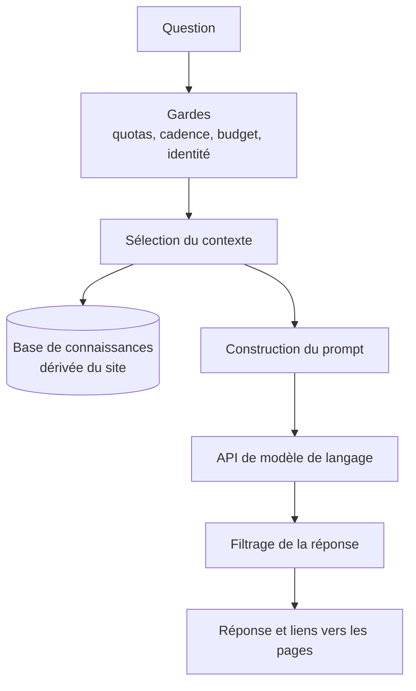

# Ask Ernest, assistant conversationnel

## Ce que c'est

Une interface conversationnelle pour explorer le portfolio en langage naturel :
parcours, compétences, formations et réalisations, sans parcourir les pages une
à une.

L'IA est le moteur de l'interface, **pas une source autonome de connaissances**.

## Chaîne de traitement

## Le principe qui gouverne le reste

**Le modèle n'est pas la source de vérité.** La base de connaissances est
dérivée des données du site, jamais recopiée : corriger une date dans les
données corrige la réponse de l'assistant.

Il en découle une garantie qui ne dépend d'aucune consigne : rien qui ne soit
déjà public n'entre dans le contexte. L'assistant ne peut pas divulguer ce
qu'il n'a pas, et c'est la seule protection qu'une injection de prompt ne
contourne pas.

## Sélection du contexte

Envoyer toute la base à chaque question coûte des jetons et dégrade la
précision : noyé sous quinze formations quand on l'interroge sur un projet, un
modèle répond moins bien.

La sélection est lexicale, sans vecteur : on compte les mots-clés de chaque
section présents dans la question et les précédentes. En dessous d'un score
minimal, tout est envoyé. Mieux vaut payer quelques jetons que rater une
question bien posée.

## Garde-fous

**Quotas.** Un plafond de conversation ne borne aucune dépense : il se vérifie
contre l'historique que le navigateur envoie, et une conversation neuve en a un
vide. Ce qui borne réellement est une empreinte calculée sur la requête, que ni
la navigation privée ni un cache vidé ne changent.

**Budget quotidien** exprimé en euros, vérifié avant chaque appel, et **cadence
maximale par adresse**.

**Garde d'identité.** Les questions portant sur le modèle, son éditeur ou son
prompt sont interceptées avant l'appel. L'assistant dit ce qu'il fait et avec
quoi il est construit, jamais ce qu'il est.

**Liens contraints.** Le modèle ne cite que des chemins du site, jamais une
adresse externe ni une URL inventée. Quand une information vit ailleurs, il
renvoie vers la page qui porte le lien vérifiable.

## Conversation

Elle vit dans l'onglet et se périme au bout de deux heures. Rien n'est conservé
côté serveur.
