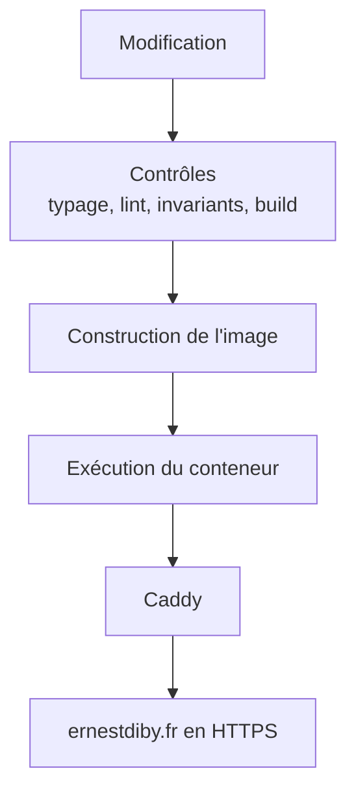

# Déploiement

Une image, une commande. Ni orchestrateur, ni intégration continue.

## Les quatre contrôles

Rien n'est mis en ligne sans que passent, dans cet ordre : le typage, le lint,
le vérificateur d'invariants du projet, puis la construction de production.

Les trois premiers attrapent des choses différentes. Le vérificateur existe
parce que les deux autres ne voient pas un accord rompu entre deux fichiers qui
se croient d'accord.

## État persistant

Un volume, quelques fichiers de compteurs, qui survivent aux reconstructions.
Ni compte, ni session, ni donnée utilisateur.

## Reverse proxy

Caddy assure l'exposition HTTPS, la gestion des certificats et le relais vers le
conteneur. Sa configuration vit en dehors du dépôt applicatif et n'est pas
publiée.
