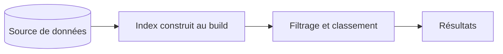

# Recherche du site

## Principe

L'index est construit **à la compilation**, depuis la même source de données que
les pages. Aucun moteur externe, aucune requête réseau au moment de la
recherche.

Une réalisation ajoutée à la source entre dans l'index sans intervention.

## Ce qui est indexé

Réalisations, domaines de compétence, expériences, formation initiale,
formations, carnets publiés, puis les pages du site.

Chaque entrée porte un texte élargi au-delà du titre : description, catégorie,
problème traité, impact, technologies. On retrouve ainsi une réalisation en
cherchant un outil qu'elle emploie, sans que cet outil figure dans son titre.

## Classement

Quatre critères, du plus au moins déterminant :

1. le titre est la requête ;
2. le titre commence par la requête ;
3. tous les mots sont dans le titre, plutôt que dans le texte élargi ;
4. à égalité, le titre le plus court gagne.

Le dernier compte plus qu'il n'y paraît : un titre court qui contient le mot en
est le sujet.

La comparaison est insensible à la casse et aux accents des deux côtés.
